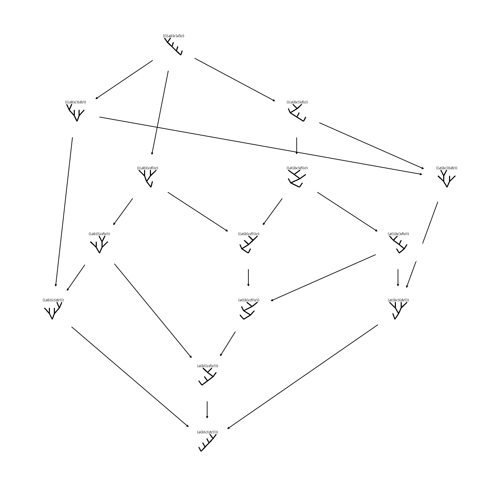

# Assoc - a hacky holiday project

This is a quick-and-dirty hacky attempt at working with **monoidahedra** in Python.
Monoidahedra provide a way of algorithmically constructing axioms for weak n-categories, for more details take a look at e.g.:

- Todd Trimble's notes on th Bar Constructions and Combinatorics of Polyhedra for n-Categories: http://math.ucr.edu/home/baez/trimble/barconstructions.pdf
- His definition of tetracategories (weak 4-categories): http://math.ucr.edu/home/baez/trimble/tetracategories.html
- Alexander E. Hoffnung, Spans in 2-Categories: A Monoidal Tricategory: https://arxiv.org/pdf/1112.0560.pdf

I was interested in playing around with monoidahedra computationally ever since I had a look at Trimble's notes earlier this year,
but never really committed to it, until I saw a series of tweets on the topic:

<blockquote class="twitter-tweet">

If someone wrote someone software to generate axioms for weak n-categories explicitly then that would be 🔥
&mdash; Jade Master (@JadeMasterMath)
<a href="https://twitter.com/JadeMasterMath/status/1187416737878142977?ref_src=twsrc%5Etfw">October 24, 2019</a></blockquote>

<blockquote class="twitter-tweet">

Todd Trimble understands the n-category axioms algorithmically, and that&#39;s how he created the diagrams of the tetracategory axioms here:<a href="https://t.co/j12HpS3vx6">https://t.co/j12HpS3vx6</a>  But he did it by hand, not using a computer at all. So yeah, it would be nice to have software that did this stuff.
&mdash; John Carlos Baez (@johncarlosbaez)
<a href="https://twitter.com/johncarlosbaez/status/1187453007899717632?ref_src=twsrc%5Etfw">October 24, 2019</a></blockquote>

<blockquote class="twitter-tweet">

Huh, I had no idea, I thought there were conceptual barriers at each new dimension  So, if a higher category theorist and a hacker worked together they could probably knock something out in a couple of hours (or maybe a couple of days to do it &quot;nicely&quot;)
&mdash; julesh (@_julesh_)
<a href="https://twitter.com/_julesh_/status/1187454990559956992?ref_src=twsrc%5Etfw">October 24, 2019</a></blockquote>

So now it's holiday season and I finally have some time to hack something together, and here it is.

## Warning! Work in progress

Right now this repo is written in some very hacky Python, by a biologist turned math/machine learning-person.
Feel free to play around with it, but be warned that it may be slow, hide bugs, summon demons or cause the heat death of the universe.

This repo and project is still very much work in progress. Right now, we can do stuff with arbitrary monoidahedra.
The major missing steps are automatically picking **domains and codomains** for n-category axioms given their associated
monoidahedra, plus defining **functoriahedra** and maybe seeing what's already there and ready-to-implement for higher transfors.

Also, it might be useful to at some point scrap the hacky python and rewrite all this as a Lean or Idris metaprogram to
actually generate types representing weak n-categories. Some day in the future, maybe.

## What we have

Well, we have monoidahedra implemented as trees, together with a derivation giving us the boundary of a given monoidahedron.
We can use this to get back some familiar things, such as the pentagon identity and unit axiom for 2-categories:

|pentagon|unit|
|-----------------------------------|-----------------------------|
|  |  |

Where the trees denote the nesting of parentheses and red edges denote units.

We can do these things for higher n, but the polyhedra quickly become pretty large and no longer human-readable.

|K4|K5|K6|
|--|--|--|
|  |  |  |
|U43|U54|U65|
|  |  |  |

But this does not stop us from computing more of these things, and looking at their components without
turning the whole thing into one huge image.

